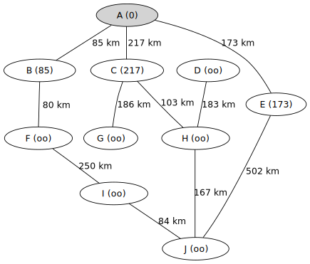

---
jupytext:
  text_representation:
    extension: .md
    format_name: myst
    format_version: 0.13
    jupytext_version: 1.11.5
kernelspec:
  display_name: Python 3 (ipykernel)
  language: python
  name: python3
---

+++ {"deletable": false, "editable": false, "nbgrader": {"cell_type": "markdown", "checksum": "d41bfa52589cd39d02b7cce6e404d2fb", "grade": false, "grade_id": "cell-28d494e048f3ca33", "locked": true, "schema_version": 3, "solution": false, "task": false}}

# Plus courts chemins, avec poids: l'[algorithme de Dijkstra](https://fr.wikipedia.org/wiki/Algorithme_de_Dijkstra)

+++ {"deletable": false, "editable": false, "nbgrader": {"cell_type": "markdown", "checksum": "2aa560901671da92dab6758c349d72fd", "grade": false, "grade_id": "cell-2418dd5b544980bf", "locked": true, "schema_version": 3, "solution": false, "task": false}, "slideshow": {"slide_type": "slide"}}

On considère le graphe suivant qui modélise un réseau routier:
<!-- By HB (Own work) [GFDL (http://www.gnu.org/copyleft/fdl.html) or CC BY-SA 3.0 (https://creativecommons.org/licenses/by-sa/3.0)], via Wikimedia Commons

<center>



</center>
!-->

```{code-cell} ipython3
---
deletable: false
editable: false
nbgrader:
  cell_type: code
  checksum: a496651197da3c9bea017a280f0ef29e
  grade: false
  grade_id: cell-932285cf25ec6af1
  locked: true
  schema_version: 3
  solution: false
  task: false
---
from graph import examples
G = examples.dijkstra()
G.show()
```

+++ {"deletable": false, "editable": false, "nbgrader": {"cell_type": "markdown", "checksum": "32c631358c34369d5626ccf66282b856", "grade": false, "grade_id": "cell-541e8093bec607c5", "locked": true, "schema_version": 3, "solution": false, "task": false}}

On souhaite calculer le plus court chemin entre deux sommets de ce graphe.

+++ {"deletable": false, "editable": false, "nbgrader": {"cell_type": "markdown", "checksum": "293b24a63cda615f4243f85792234eaf", "grade": false, "grade_id": "cell-e111cf0686add8e0", "locked": true, "schema_version": 3, "solution": false, "task": false}}

**Exercice**
1. Implantez l'algorithme de Dijskstra

```{code-cell} ipython3
---
deletable: false
nbgrader:
  cell_type: code
  checksum: d8489af7e478873b066773c143b6b093
  grade: false
  grade_id: cell-b31db819a71cdffd
  locked: false
  schema_version: 3
  solution: true
  task: false
---
from graph import Graph, Node, Dict
infinity = float('inf')
def dijkstra(G: Graph, e: Node) -> Dict[Node, int]:
    """
    Renvoie un dictionnaire associant à chaque sommet sa distance depuis `e`
    """
    distances = {node: infinity if node != e else 0 for node in G.nodes()}
    todo = set(G.nodes())
    while todo:
        u = min(todo, key=distances.get)
        todo.remove(u)
        for w in G.neighbors(u):
            if w in todo:
                alt = distances[u] + G.capacity(u, w)
                if alt < distances[w]:
                    distances[w] = alt
    return distances
```

+++ {"deletable": false, "editable": false, "nbgrader": {"cell_type": "markdown", "checksum": "a45e96cf27882df09754131d7dbea6fc", "grade": false, "grade_id": "cell-9052d311cb4ac13d", "locked": true, "schema_version": 3, "solution": false, "task": false}}

2. Appliquez cette fonction au graphe `G` ci-dessus:

```{code-cell} ipython3
---
deletable: false
nbgrader:
  cell_type: code
  checksum: 2e0bca3fd9fc01af654994bedd305fc9
  grade: false
  grade_id: cell-f52c1bf66d323bc2
  locked: false
  schema_version: 3
  solution: true
  task: false
---
dijkstra(G, "A")
```

+++ {"deletable": false, "editable": false, "nbgrader": {"cell_type": "markdown", "checksum": "646f89cc1c5a06298411f94358d2612b", "grade": false, "grade_id": "cell-09260c8bcd80db6a", "locked": true, "schema_version": 3, "solution": false, "task": false}}

En déduire la distance entre `A` et `J`, à mettre dans la variable `distance_AJ`:

```{code-cell} ipython3
---
deletable: false
nbgrader:
  cell_type: code
  checksum: c4b4ca3e455fd152e6b71f55744fd3b5
  grade: false
  grade_id: cell-1f02da44eb448e2d
  locked: false
  schema_version: 3
  solution: true
  task: false
---
distance_AJ = dijkstra(G, "A")["J"]
```

```{code-cell} ipython3
---
deletable: false
editable: false
nbgrader:
  cell_type: code
  checksum: 4cdb0c6782d42fd1c1a7ab80bb999a66
  grade: true
  grade_id: cell-4efcd06723aa15a5
  locked: true
  points: 1
  schema_version: 3
  solution: false
  task: false
---
# Vérifie votre résultat sans dévoiler la solution, par la magie des fonctions de hachage :-)
import hashlib
h = hashlib.md5(bytes(distance_AJ)).hexdigest() == '2f6064003b888e403627e493532fc751'
```

```{code-cell} ipython3
---
deletable: false
editable: false
nbgrader:
  cell_type: code
  checksum: ce650eb520938304735e7f74cdf5ee18
  grade: true
  grade_id: cell-0d543769776d9f6a
  locked: true
  points: 1
  schema_version: 3
  solution: false
  task: false
---
distances = dijkstra(G, "A")
assert distances["A"] == 0
```

```{code-cell} ipython3
---
deletable: false
editable: false
nbgrader:
  cell_type: code
  checksum: f5a672969316dc0b04f2756192bdf43f
  grade: true
  grade_id: cell-4670834a66e9e247
  locked: true
  points: 2
  schema_version: 3
  solution: false
  task: false
---
assert sum(distances.values()) == 2774
```

+++ {"deletable": false, "editable": false, "nbgrader": {"cell_type": "markdown", "checksum": "ec47e6b4c737c953b6dd29b52a656d49", "grade": false, "grade_id": "cell-73fa8b07519bc08b", "locked": true, "schema_version": 3, "solution": false, "task": false}}

3. (Bonus) Adapter la fonction précédente pour qu'elle prenne deux sommets `e` et `f` et renvoie un plus court chemin entre `e` et `f`.

```{code-cell} ipython3
---
deletable: false
nbgrader:
  cell_type: code
  checksum: 7707819c72c8f3d542e9132401d38233
  grade: true
  grade_id: cell-6e6fadae5c937751
  locked: false
  points: 0
  schema_version: 3
  solution: true
  task: false
---
# VOTRE CODE ICI
raise NotImplementedError()
```

+++ {"deletable": false, "editable": false, "nbgrader": {"cell_type": "markdown", "checksum": "6378da0514a1e3a4a7fd6ef6ac7b079a", "grade": false, "grade_id": "cell-bc2add573b4d29c0", "locked": true, "schema_version": 3, "solution": false, "task": false}}

4. (Bonus) Instrumentez votre fonction pour en visualiser l'exécution.

```{code-cell} ipython3
import copy
```

```{code-cell} ipython3
---
deletable: false
nbgrader:
  cell_type: code
  checksum: e17102cb766d7f7c3e2a7bad5e5d07c0
  grade: true
  grade_id: cell-06c0e69a490a9644
  locked: false
  points: 0
  schema_version: 3
  solution: true
  task: false
---
from graph import Graph, Node, Dict
infinity = float('inf')
def dijkstra_visualisation(G: Graph, e: Node) -> Dict[Node, int]:
    """
    Renvoie un dictionnaire associant à chaque sommet sa distance depuis `e`
    """
    distances = {node: infinity if node != e else 0 for node in G.nodes()}
    todo = set(G.nodes())
    
    player.player.reset(copy.deepcopy(locals()))
    
    while todo:
        u = min(todo, key=distances.get)
        todo.remove(u)
        # Observation des variables locales
        player.set_value(copy.deepcopy(locals()))
        for w in G.neighbors(u):
            if w in todo:
                alt = distances[u] + G.capacity(u, w)
                if alt < distances[w]:
                    distances[w] = alt
                # Observation des variables locales
                player.set_value(copy.deepcopy(locals()))
        u = None
        # Observation des variables locales
        player.set_value(copy.deepcopy(locals()))
    return distances
```

```{code-cell} ipython3
import graph_algorithm_player
variables = [{'name': 'G',      'type': 'graph'},
             {'name': 'distances', 'type': 'nodes', 'color': 'green',  'display': True},
             {'name': 'todo',   'type': 'nodes', 'color': 'red',    'display': True},
             {'name': 'u',      'type': 'node',  'color': 'yellow', 'display': True}]
player = graph_algorithm_player.GraphAlgorithmPlayer(variables=variables)
player
```

```{code-cell} ipython3
dijkstra_visualisation(G, "A")
```

+++ {"deletable": false, "editable": false, "nbgrader": {"cell_type": "markdown", "checksum": "6508f3d1b1c6a16d213875d14b85868b", "grade": false, "grade_id": "cell-712564125b629eea", "locked": true, "schema_version": 3, "solution": false, "task": false}}

## Problème 1: Le chemin le plus rapide en métro de Montgallet à Billancourt ?
<center>


</center>

1. Le fichier <a href="metro_complet.txt">metro_complet.txt</a> contient la description d'un graphe modélisant le métro de Paris. Consultez son contenu pour en comprendre le format.
2. Écrire une fonction qui lit le fichier et renvoie le graphe qu'il contient sous la forme d'un objet de type `Graph`.
3. Utilisez la fonction `dijkstra` pour calculer un plus court chemin de Montgallet à Billancourt!

```{code-cell} ipython3
---
deletable: false
nbgrader:
  cell_type: code
  checksum: 665120a2ba92bf201f11ba072aba38a9
  grade: true
  grade_id: cell-7e01ead24612c65d
  locked: false
  points: 3
  schema_version: 3
  solution: true
  task: false
---
def extract_graph(file: str):
    with open(file, "r") as f:
        fetching_nodes = False
        fetching_edges = False
        id_name = {}
        name_id = {}
        edges = []
        for line in f:
            line = line.strip()
            if not line:
                continue
            if line == "noms sommets":
                fetching_nodes = True
                continue
            if line == "coord sommets":
                fetching_nodes = False
                continue
            if fetching_nodes:
                tab = line.split()
                s_num = tab[0]
                name = ' '.join(tab[1:])
                id_name.update({int(s_num): name})
                name_id.update({name: int(s_num)})
            if line == "arcs values":
                fetching_edges = True
                continue
            if fetching_edges:
                i, j, c = line.split()
                edges.append((int(i), int(j), int(float(c))))
        return Graph(list(id_name.keys()), edges=edges, directed=True), id_name, name_id
```

```{code-cell} ipython3
G, id_name, name_id = extract_graph("metro_complet.txt")
```

N.B: il y a des noms en double, et mon dictionnaire name_id associe seulement un seul identifiant à chaque nom.

```{code-cell} ipython3
name_id["Montgallet"]
```

```{code-cell} ipython3
name_id["Billancourt"]
```

Version sauvegardeant le predecesseur de chaque noeud dans `prev`

```{code-cell} ipython3
from graph import Graph, Node, Dict
infinity = float('inf')
def dijkstra(G: Graph, e: Node) -> Dict[Node, int]:
    """
    Renvoie un dictionnaire associant à chaque sommet sa distance depuis `e`
    """
    distances = {node: infinity if node != e else 0 for node in G.nodes()}
    prev = {node: None for node in G.nodes()}
    todo = set(G.nodes())
    while todo:
        u = min(todo, key=distances.get)
        todo.remove(u)
        for w in G.neighbors(u):
            if w in todo:
                alt = distances[u] + G.capacity(u, w)
                if alt < distances[w]:
                    distances[w] = alt
                    prev[w] = u
    return distances, prev
```

```{code-cell} ipython3
distances, prev = dijkstra(G, name_id["Montgallet"])
```

```{code-cell} ipython3
curr = name_id["Billancourt"]
path = []
while curr:
    path.append(id_name[curr])
    curr = prev[curr]
```

L'itinéraire proposé est de prendre la ligne 8 jusqu'à la Bastille, ensuite la ligne 1 jusqu'à Franklin D. Roosevelt, ensuite la ligne 9 jusqu'à Billancourt.

```{code-cell} ipython3
path[::-1]
```

```{code-cell} ipython3
distances[name_id["Billancourt"]]
```
